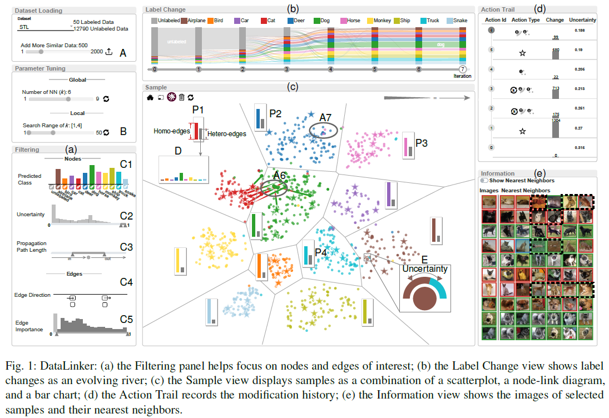

DataLinker
======================

Introduction
--
DataLinker is a visual analysis tool for graph-based semi-supervised learning (GSSL).
It supports users to explore the graph structure for better understanding of label propagation in GSSL,
identify which part of the graph may cause performance deterioration,
and modify the graph structure for better model performance.
An online demo is available at: http://datalinker.thuvis.org/Demo.


Quick Start with Demo Data
-----------------
Step 1: download demo data from [here](https://drive.google.com/file/d/1B6C7dQTgtVahTXSyLXNuMbEgP15r2lQ-/view?usp=sharing), and unpack it in root folder.

Step 2: setup the system:
```python manager.py run 8181```

Step 3: visit http://localhost:8181/ in a browser.
